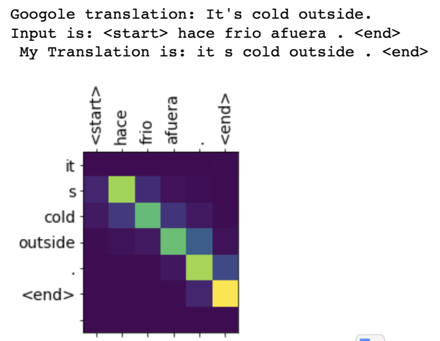
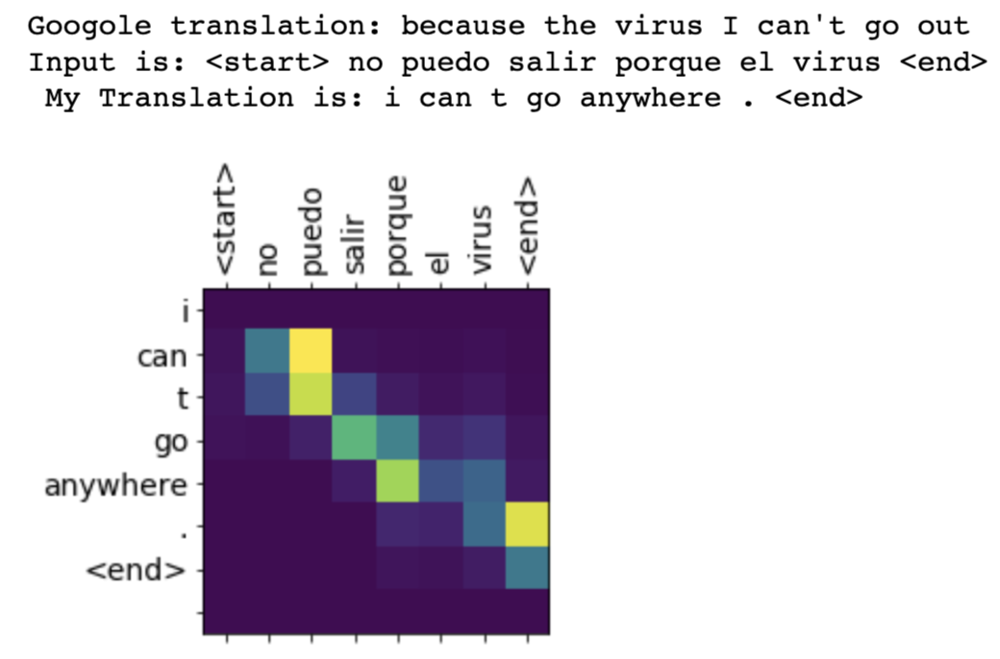

# 词嵌入

项目说明：【待补充】，在代码中也有很多注释，足以明白这个项目了

项目代码：  [查看代码](word_embedding.ipynb)

设计上游任务为电影评论分类，获取Embedding层的词向量，然后获得指定单词前10相似的单词

从结果来看，使用此训练并不能太好的理解词义，可能是训练集也不是很大，然后这个任务也不是很适合理解词义（可能使用skip-gram模型或者CBOW模型在配合维基百科语料库更好做这个任务），仅仅训练了10个周期,最终结果可能也和embedding层的随机初始化有关。

当然，在这一个过程中，对于词嵌入还是有了更多的理解。

最终训练结果如下：

本地训练，Embedding_size=50,epoch=10,最相似的10个单词

> wonderful-->['wonderful', 'everyone', 'haunting','underrated', 'brilliant', 'fantastic', 'High', 'superb','marvel','recommended']

colab上，embedding_size=300,epoch=10，最相似的10个单词

> womderful-->['wonderful', 'haunting', 'everyone', 'brilliant', 'marvel', 'fantastic', 'underrated', 'superb', 'perfect', 'flaw']

# RNN文本分类

项目说明：【待补充】，在代码中也有很多注释，足以明白这个项目了

项目代码：[查看代码](使用RNN进行文本分类.ipynb)

使用循环神经网络完成IMDB电影评论分类（positive or negative）

最终对自己输入的影评进行打分（0-1）

最终训练结果如下：

```
comment is: this movie is bad. but the actor is very handsome and I like him. but I will not recommend this movie.
here is the point: 0.17458665
```

```
comment is: The movie was cool. The animation and the graphics were out of this world. I would recommend this movie.
here is the point:0.9981263
```

```
comment is: actually, I am the actor's fans. But his performance in the movie break my heart.
here is the point:0.47038242
```

```
comment is: The characters is not famous, but their performances make the movie reach a very high level! 
here is the point:0.9868593
```

```
comment is: The movie is very ironic.This film criticizes the social phenomena without conscience
here is the point:0.99971634
```

# 莎士比亚风格文本生成

项目说明：【待补充】，在代码中也有很多注释，足以明白这个项目了

项目代码：[查看代码](莎士比亚风格文本生成.ipynb)

对莎士比亚的作品学习，给定起始字符（下方运行结果中，给定的起始单词为'ROME: '）,训练出来的模型将会自动生成莎士比亚风格类型的文本。

### 运行结果：

> ROMEO:
> 
> I advance fiture each other,  
>How many haughty love, your own suspicion from so rounder he divide,  
> As if I had some all fell.   
> 
> Fullow:  
> Bleased the soldiers, Cleome,  
> And thou hadst beat me back to Man.  
>In an outward stars that sle with thee?  
> Why should she noble endary?    
> 
> .............

# 注意力模型-机器翻译

项目说明：【待补充】，在代码中也有很多注释，足以明白这个项目了

项目代码：[查看代码](注意力机制-机器翻译.ipynb)

基于Bahdanau注意力模型，论文中底层使用双向RNN（这里使用的单向GRU）。 计算得分，

论文使用的是Si-1（decoder-hidden-state）与hj（encoder-hidden-state） 在下面的模型中，使用的是decoder-hidden-state与encoder-output。

为了便于训练，我只使用了30000条较短的数据（西班牙语--->英语），对于较短句子（10个单词以内）翻译效果还行。

若想获得更好的效果，可以使用更多的语料(num_samples=None)，在colab上训练更多的周期。

## 运行结果






